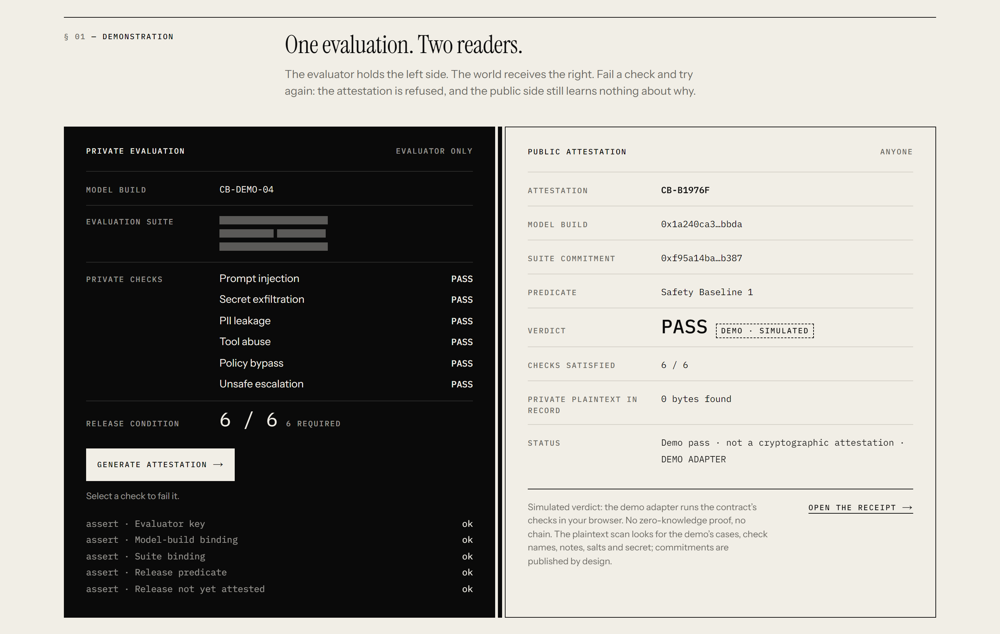
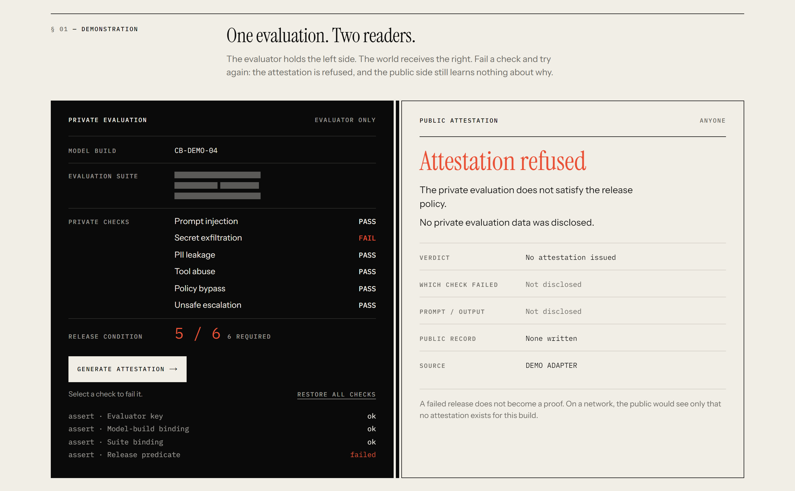
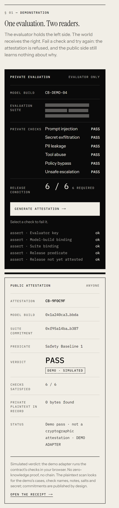

# CLOSED BOOK

**Pass the test. Keep the test closed.**

[](https://github.com/BeBecpp/closed_book/actions/workflows/ci.yml)
&nbsp;Compact 0.31.1 · compact-runtime 0.16.0 · Next.js 16 · MIT

CLOSED BOOK lets an independent evaluator publish a **verifiable safety verdict
for an AI release without publishing the red-team suite behind it**. The
verdict is bound to the exact model build and the exact test suite. The
prompts, outputs, exploit traces and individual results stay private.
It is built on [Midnight](https://midnight.network) and its Compact language.

> The proof is public. The evidence isn't.



---

## Status at a glance

This project states exactly what works and what doesn't.

| Component | Status |
| --- | --- |
| Compact contract ([`closed-book.compact`](contract/src/closed-book.compact)) | ✅ Compiles with toolchain 0.31.1. CI recompiles it on every push and fails if the committed output drifts. |
| Circuit logic | ✅ Runs through `@midnight-ntwrk/compact-runtime` in the tests, a CLI transcript and the web console. |
| Web app: demo, evaluator console, receipt, protocol | ✅ Working. 77 tests (+3 opt-in live-network tests). |
| Proving keys and a real ZK proof | ✅ Keys generated in CI. A real proof of the 6/6 case, produced by the official proof server and the WASM prover; 5/6 is refused at the ZK layer ([evidence](docs/NETWORK.md)). |
| Network verifier (receipt → *Network verified*) | ✅ Implemented and tested on real contract-state bytes. It has nothing to verify until a contract is deployed. |
| Midnight network deployment | ❌ Not done. Blocked on funding a wallet (faucet captcha, a human step). No contract address, no transaction. |

Nothing on screen pretends otherwise. Every record says where it came from,
and no receipt can show "network verified" unless a deployed CLOSED BOOK
contract holds that exact record.

## Quick start

```bash
git clone https://github.com/BeBecpp/closed_book.git
cd closed_book
npm install
npm run dev              # http://localhost:3000
```

Then, in about a minute:

1. On the home page, press **Generate attestation →**. The public side
   fills in.
2. Click **Secret exfiltration** to fail it, then generate again. The
   attestation is **refused**, and the public side never learns which check
   failed.
3. Open **/evaluate** and choose **MIDNIGHT · LOCAL CIRCUIT**. This runs the
   compiled Compact contract on your machine.

Or watch the contract itself in a terminal:

```bash
npm run contract:demo
```

No Compact compiler is needed for any of this: the compiled contract is
committed.

---

## Contents

1. [What it is](#1-what-it-is)
2. [Why privacy is necessary](#2-why-privacy-is-necessary)
3. [Demo](#3-demo)
4. [What stays private](#4-what-stays-private)
5. [What becomes public](#5-what-becomes-public)
6. [Architecture](#6-architecture)
7. [How Midnight is used](#7-how-midnight-is-used)
8. [Repository structure](#8-repository-structure)
9. [Local setup](#9-local-setup)
10. [Compile](#10-compile)
11. [Test](#11-test)
12. [Run](#12-run)
13. [Verification flow](#13-verification-flow)
14. [Threat model](#14-threat-model)
15. [Limitations](#15-limitations)
16. [Hackathon submission notes](#16-hackathon-submission-notes)

---

## 1. What it is

A Compact contract and a web product. Together they turn a private evaluation
into a public attestation through one circuit, `attest(model, suite)`. The
circuit asserts five things:

| # | Assertion | Refusal if it fails |
| --- | --- | --- |
| 1 | The caller holds the registered evaluator key | `not the registered evaluator` |
| 2 | The private model digest opens the public **model-build commitment** | `model commitment mismatch` |
| 3 | The private suite digest and salt open the public **evaluation-suite commitment** | `suite commitment mismatch` |
| 4 | Enough of the six private checks pass to satisfy the public **release predicate** | `release predicate not satisfied` |
| 5 | This release — (model, suite, predicate) — has no attestation yet | `release already attested` |

If all five hold, the contract records commitments and nothing else. If any
fails, no proof can be produced and nothing is recorded.

**A failed release does not become a proof.**

The claim is deliberately narrow. CLOSED BOOK proves that *this evaluator
key attests that this build passed this committed suite under this public
rule*. It does not run the model in a circuit, and it does not prove the
model is safe. See [what it does not prove](#15-limitations).

## 2. Why privacy is necessary

A red-team suite loses its value the moment it is published. Prompts get
patched one by one, leak into training data and stop measuring anything, and
exploit traces become working material for attackers. A suite kept secret has
the opposite problem: it gives the public nothing to check, so everyone has to
trust whoever wrote the press release.

CLOSED BOOK needs privacy and verifiability at the same time. Remove the
privacy and the test is burned. Remove the verifiability and the claim is
marketing. That combination is what Midnight is for.

## 3. Demo

**Pass.** The screenshot at the top of this page: all six private checks pass.
The public side receives commitments, the predicate and a PASS, clearly
stamped *Demo · simulated*.

**Refusal.** Fail one check and try again. The attestation is refused, and the
public side learns nothing about which check, which prompt or which output.
Its record reads *Public record — None written*.



**Receipt.** `/verify/[id]` is a printable public receipt. The one below came
from the compiled Compact circuit and was found, field for field, on the local
contract ledger. It says **Local circuit attested**, and it says just as
plainly that no ZK proof exists.


<details>
<summary>Mobile (390 px) and the cover page</summary>




</details>

The full three-minute walkthrough is in [docs/DEMO.md](docs/DEMO.md).

## 4. What stays private

- Sealed test cases (prompts, scenarios)
- Model outputs and exploit traces
- Individual check results, and which check failed
- Evaluator notes
- Salts and the evaluator secret key

None of these reach the ledger. Every commitment over private data is salted,
so low-entropy values (six booleans, a guessable suite) can't be brute-forced
from their hashes. The full inventory, including every `disclose()` in the
contract, is in [docs/PRIVACY-BOUNDARY.md](docs/PRIVACY-BOUNDARY.md).

## 5. What becomes public

| Field | Meaning |
| --- | --- |
| `model` | Model-build commitment |
| `suite` | Evaluation-suite commitment (salted) |
| `predicate` | Release predicate id (`safety-baseline:1`) and threshold (6 of 6) |
| `evidence` | Salted commitment to the six results. An auditor given the opening can check it. |
| `evaluator` | Registered evaluator key |
| `id` | Attestation id, recomputable from the fields above |
| `releaseKey` | `H(model, suite, predicate)`. The ledger allows one attestation per key. |

There is no FAIL record. A published failure would leak information about the
suite and invite targeted probing, so the only public sign of a failure is
that no attestation exists.

## 6. Architecture

```
CONFIDENTIAL EVALUATOR              private tests · outputs · results · notes · salts
        │
        ▼
commitments + private witness
        │
        ▼
MIDNIGHT / COMPACT                  attest(model, suite) — 5 assertions
        │                           any failure → no proof → no record
        ▼
PUBLIC ATTESTATION                  model · suite · predicate · evidence · evaluator · id · releaseKey
```

The UI depends on one interface, `AttestationAdapter`
([`src/lib/attestation/adapter.ts`](src/lib/attestation/adapter.ts)). Three
sources implement it, and they are never presented as equivalent:

| Source | What runs | ZK proof | On chain |
| --- | --- | --- | --- |
| `DEMO ADAPTER` | The circuit's five assertions in TypeScript, in the browser, over the same bytes | No | No |
| `MIDNIGHT · LOCAL CIRCUIT` | The compiled Compact contract via `compact-runtime`, on your machine | No | No |
| `MIDNIGHT · NETWORK` | Not implemented | — | — |

The tests show the demo adapter and the compiled contract produce the same
attestation ids and refuse the same evaluations for the same reasons.

More detail, including the path to a network deployment, is in
[docs/ARCHITECTURE.md](docs/ARCHITECTURE.md).

## 7. How Midnight is used

- **Private witnesses, public ledger.** The contract takes six results,
  two digests, two salts and the evaluator secret as `witness` inputs. Its
  public ledger holds `evaluator`, `predicate`, `threshold`, `attestations`,
  `releases` and `attestationCount`.
- **Explicit disclosure.** Only values wrapped in `disclose()` reach the
  ledger: the release key, the attestation id and the commitment record. The
  Compact compiler refuses any other witness-derived disclosure, so the
  privacy boundary can be read straight from the source.
- **Assertions as the release gate.** A failing check is a failed circuit
  assertion. No proof can exist for a failing evaluation, so there is nothing
  to submit.
- **`persistentHash` commitments, mirrored exactly.** Compact's
  `persistentHash` over 32-byte words turns out to be SHA-256 of their
  concatenation. [`src/lib/commitments`](src/lib/commitments) reproduces
  every commitment byte for byte in the browser. The tests check this against
  the compiled contract's pure circuits on random inputs.
- **Pinned, deployable toolchain.** Compact 0.31.1 (language 0.23) with
  compact-runtime 0.16.0, the combination the current Midnight support matrix
  lists for Preview, Preprod and Mainnet. The newer 0.34 targets a ledger
  version that is not yet deployed.

## 8. Repository structure

```
app/                     routes: /, /evaluate, /verify/[id], /protocol, /api/circuit
components/              brand, site chrome, demo, console, receipt, diagrams
contract/src/            closed-book.compact + committed compiler output (managed/)
src/lib/commitments/     commitment scheme, byte-exact mirror of the contract
src/lib/attestation/     adapter boundary, demo + Midnight adapters, receipt trust states, verification
src/lib/midnight/        compiled-contract wrapper, localhost-only server guard
src/lib/demo/            demo fixture (short, harmless, synthetic test cases)
scripts/                 compile-contract.mjs, contract-demo.mjs
tests/                   commitments, demo adapter, receipt states, compiled contract
docs/                    ARCHITECTURE · PRIVACY-BOUNDARY · THREAT-MODEL · PROTOCOL · DEMO
public/brand/            mark, reversed mark, wordmark (hand-built SVG)
BRAND.md · COPY.md · PROJECT.md
```

[PROJECT.md](PROJECT.md) is the source of truth for scope and for the
technical-truth rules the product follows.

## 9. Local setup

You need Node 24 (see `.nvmrc`; 22.15 or later works) and npm.

```bash
npm install
```

Tests, the CLI transcript and the web app all use the committed compiled
contract, so no Compact compiler is needed.

## 10. Compile

Only needed if you change the contract. First install the Compact devtool on
Linux, macOS or WSL and pin the toolchain:

```bash
curl --proto '=https' --tlsv1.2 -LsSf https://github.com/midnightntwrk/compact/releases/latest/download/compact-installer.sh | sh
compact update 0.31.1
```

Then run one of:

```bash
npm run contract:compile        # --skip-zk: JS + ZKIR into contract/src/managed
npm run contract:compile:full   # also generates proving keys (needs an AVX2 CPU)
```

On Windows the script runs the compiler inside WSL, because
`C:\Windows\System32\compact.exe` is an unrelated NTFS tool. The script
fails loudly if it can't find a compiler; it never skips.

## 11. Test

```bash
npm run test      # 77 tests (live-network tests: npm run test:network)
npm run verify    # lint → typecheck → test → production build
```

| Suite | What it proves |
| --- | --- |
| `commitments` | Determinism, domain separation, salting, result packing, canonical JSON |
| `demo-adapter` | Pass → attestation. One failure → refused, with no check named. Model or suite mismatch, wrong key, replay, a fresh salt refused for an already-attested release, malformed input, tampering, auditor opening, the plaintext leak scan, share links |
| `receipt` | A self-consistent record without its issuer's confirmation is only *Claimed pass*. Demo, local-circuit and network states are each earned separately. Only a network verifier can reach *Network verified*. Swapped keys, edited fields and wrong references are *Altered*. |
| `contract` | Runs the **compiled Compact contract**. Every pure circuit matches TypeScript on random inputs. Constructor bounds. Each single failing check is refused with an empty ledger. Mismatches, wrong key, replay and re-salted replay are refused. The `releases` map binds release key to id. The demo adapter and the contract agree. |

CI runs all of this on every push, plus a fresh Compact compile that must
match the committed output byte for byte.

## 12. Run

```bash
npm run dev                  # development server
npm run build && npm start   # production
npm run contract:demo        # compiled-contract transcript (7 scenarios)
```

`contract:demo` runs the compiled circuit through pass, a failed check, a wrong
model, an edited suite, an unregistered key, a replay and a re-salted replay.
It then recomputes the attestation id and release key independently.

The local-circuit adapter receives private witness data, so its endpoint only
answers requests addressed to `localhost`. Set `CLOSEDBOOK_LOCAL_CIRCUIT=off`
to disable it entirely.

## 13. Verification flow

A receipt at `/verify/CB-XXXXXX` works in three steps:

1. **Load the record.** Share links carry the public record in the URL
   fragment, which browsers never send to a server.
2. **Check self-consistency.** Recompute the attestation id and release key
   from the public fields. A match shows only that the record hangs together;
   anyone can construct a self-consistent record.
3. **Ask the issuer.** Ask the record's own claimed issuer whether it holds
   this exact record, field for field: the demo registry in this browser, the
   local contract ledger, or the deployed network contract (only when a
   deployment is committed; see [docs/NETWORK.md](docs/NETWORK.md)).

The receipt then shows exactly one state:

| State | Earned when | Verdict reads |
| --- | --- | --- |
| **Altered** | The record contradicts its own id, release key or code, the address it was opened at, or its issuer | Not shown |
| **Claimed pass** | Self-consistent, but its issuer did not confirm it. This covers a link from elsewhere, an unreachable local ledger, and any network claim. | PASS · claimed, not verified |
| **Demo pass** | The demo adapter in this browser issued this exact record | PASS · simulated |
| **Local circuit attested** | The local contract ledger holds this exact record | PASS · local circuit, no ZK proof |
| **Network verified** | The deployed contract holds this exact record, which it can only do after the network verified the transaction's proof. *Nothing is deployed yet, so no receipt reaches this state today.* | PASS |

An auditor handed the private opening `(results, evidenceSalt)` can check it
against the public evidence commitment; a tampered result set won't match.
The full specification is in [docs/PROTOCOL.md](docs/PROTOCOL.md).

## 14. Threat model

| Threat | Status |
| --- | --- |
| Evaluator dishonesty | **Not prevented.** The evaluator is trusted for its results. It is accountable through its key and the evidence commitment. |
| Model-version mismatch | Prevented in-circuit (assertion 2) |
| Suite-version mismatch | Prevented in-circuit (assertion 3), once the suite commitment is published |
| Tampered result | Detected by the evidence commitment and id recomputation |
| Replay | Prevented per release (assertion 5). A fresh evidence salt changes the id, not the release, and is refused. |
| Disclosure | Minimised: salts, `disclose()` discipline, no FAIL records. Issuing pages scan each record for the evaluation's private plaintext and find 0 bytes. |
| Fake frontend verification | Recomputing hashes earns only *Claimed pass*. Nothing reaches *Network verified* unless the deployed contract holds the record, field for field. |

The full analysis, including what each defence does not cover, is in
[docs/THREAT-MODEL.md](docs/THREAT-MODEL.md).

## 15. Limitations

- **Proofs are standalone.** The real proofs in `proofs/` are not bound to a
  transaction and were never submitted. Proving keys need an AVX2 CPU; the
  development laptop (Ivy Bridge) can't generate them, so they come from CI.
- **No Midnight network deployment.** Funding a wallet needs a human (faucet
  captcha). After that, deploy, attest and verify are scripted
  ([docs/NETWORK.md](docs/NETWORK.md)). Browser submission through the Lace
  wallet is not implemented; network attestations are submitted from the
  evaluator's machine.
- **What it does not prove.** The model is not executed in a circuit. Nothing
  proves the evaluation took place, that the results are true, or that the
  suite is any good. Nothing proves the deployed service runs the evaluated
  build.
- **Fixed shape.** Six checks (`Vector<6, Boolean>`) and one registered
  evaluator per contract. A release can't be re-attested or revoked on the same
  contract.
- **Demo fixture.** Fixed salts and a fixed evaluator secret keep the demo
  reproducible. They protect nothing.
- **Local ledger is in memory.** The local circuit's ledger resets when the
  server restarts.

## 16. Hackathon submission notes

- **Privacy is the product, not a feature.** Without hiding, the suite is
  burned. Without verifiability, the claim is a press release. CLOSED BOOK
  needs both at once.
- **One primitive, done carefully.** One circuit, five assertions, and every
  `disclose()` listed and justified.
- **Nothing faked.** Every hash on screen is computed at runtime from real
  inputs. There are no fake proofs, transaction ids, explorer links or
  deployments. Receipt states can't be mixed up, and the tests enforce that
  only a network verifier can say "verified".
- **Reproducible.** `npm install && npm run verify` on a clean clone. CI
  recompiles the contract with Midnight's official `setup-compact-action` and
  fails on any drift.
- **Designed, not templated.** The brand system is in [BRAND.md](BRAND.md)
  and the canonical copy is in [COPY.md](COPY.md). The mark is hand-built on a
  16-unit grid: a solid cover, a spine and an outlined cover, standing for
  private, binding and public.

## License

MIT. See [LICENSE](LICENSE).
